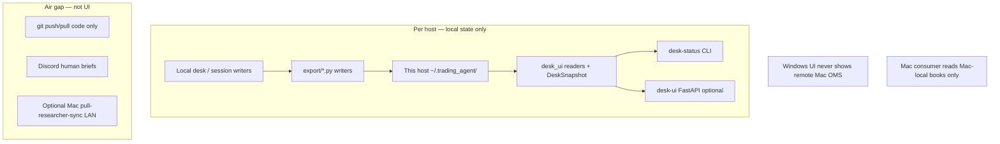
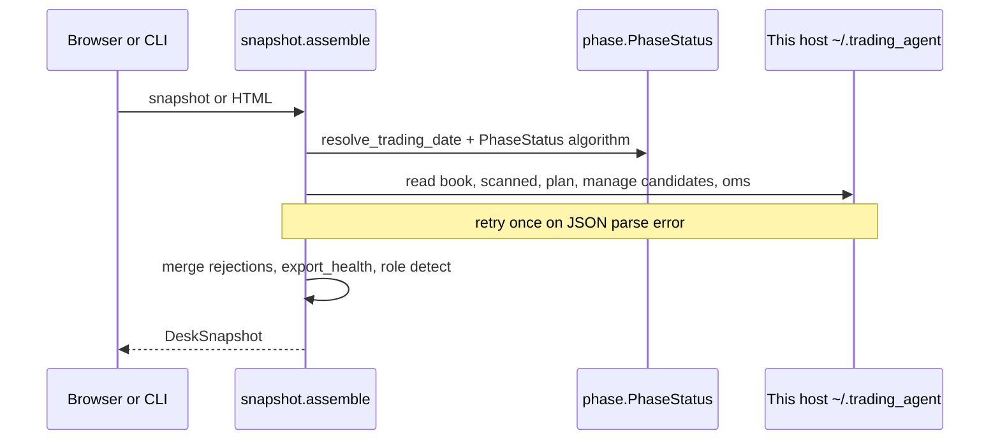

# Auto Trade Desk UI — trading_agent

| Field | Value |
|-------|--------|
| **Title** | Auto Trade Desk UI (operator dashboard for research host) |
| **Author** | TBD |
| **Date** | 2026-08-13 |
| **Status** | Draft (rev 4 — user decisions locked 2026-08-13) |
| **Owner repo** | [trading_agent](https://github.com/thaing408/trading_agent) (`C:\Personal\Grok\trading_agent`) |
| **Product** | Live CIO desk only — **not** trading_test methods lab |
| **Primary host** | Windows research host (scheduled `TradingAgentDeskSession` → `scripts/start_desk_session.py`) |

---

## Overview

Operators of the live CIO desk today diagnose auto-trade health by grepping JSON under `~/.trading_agent/sync/`, session folders, manage JSONL logs, and Discord phase posts. On 2026-08-13 that meant: research ending **stay_in_cash** with empty ENTER rows, ADR%/RVOL rejections on QQQ/IWM, and intraday manage cycles with `n_recommendations=0` while Discord only shows phase narratives—not a single interactive desk surface.

This design proposes a **local, file-backed investigation surface** owned by **trading_agent**:

1. **Primary:** local web dashboard (FastAPI + Jinja2 + HTMX) reading **this host’s** `~/.trading_agent` only.
2. **Companion (ships with pure readers, no HTTP):** CLI `python -m trading_agent desk-status` printing the same snapshot as text.

The process **never** places TOS/Schwab orders and **never** rsyncs books between machines. Optional safe writes are limited to sidecars under `~/.trading_agent/ui/` (acks, notes, optional research-only flags).

**Important dual-system nuance:** Windows export of `auto_trade_book.json` is a **local research artifact** for the operator on that host (and Discord). Production Mac execute discovers **Mac-local** books only (after local desk/QT and/or optional LAN researcher pull)—not Windows Task Scheduler paths. The UI always reflects the machine it runs on.

**Primary stack:** **FastAPI + Jinja2 + HTMX**, optional Alpine.js, `python -m trading_agent desk-ui`.

---

## Background & Motivation

### Product split (hard constraint)

| Product | Path | Role |
|---------|------|------|
| **trading_agent** | `C:\Personal\Grok\trading_agent` | Live CIO desk; Windows task `TradingAgentDeskSession` |
| **trading_test** | `C:\Personal\Grok\trading_test` | Methods lab; not scheduled desk |
| **State root** | `~/.trading_agent\` on **each host** | `sync/`, `logs/`, `oms/`, `sessions/YYYY-MM-DD/`, `process/`, `ready_orders/` — **not shared across work↔home** |

### Data plane by host (explicit)

| Host | What the UI / `desk-status` reads | What it must not assume |
|------|-----------------------------------|-------------------------|
| **Windows research** | This host’s `~/.trading_agent` (sync book, session plan, manage logs, process cards). OMS lots usually **absent** (audit-only is fine). | That Mac has the same book; that Windows `sync/` is Mac consumer truth; remote Mac OMS status |
| **macOS execute** (optional UI) | **Mac-local** books after local desk/QT; `oms/state.json`, ready_orders, kill switch; consumer paths under local home | Work PC paths; work secrets; Windows Task Scheduler state |
| **Researcher box** (e.g. `me-ai` / LAN) | Local sync if UI run there; optional Mac pull via `com.grok.pull-researcher-sync` is **outside** this UI | UI implementing pull/rsync |

**Production Mac path** (`docs/dual_system.md`, `docs/options_auto_trade.md`):

1. **Code** crosses the air gap via **git** only.
2. Mac launchd `com.grok.trading-agent-desk` runs **local** research/desk → writes **local** `auto_trade_book.json`.
3. `com.grok.auto-trade-consumer` discovers **local** books under `~/.trading_agent/sync/`, session dir, `~/.grok/state/` only.
4. Optional **third** path: LAN pull from researcher host (`RESEARCHER_HOST` / `me-ai.local`) — not Windows work-book rsync and **not** a feature of this UI.

**Hard rule (UI):** never add “show Mac remote book” or “push book to Mac.” Never rsync books from the UI.

Dual-system roles:

- **Windows research:** build plan → export local book / scanned_list → Discord. **Never** places TOS (`broker_boundary` on book).
- **Mac execute:** local books + `scripts/macos/consume_auto_trade_book.py` → ready orders / optional Schwab MCP.

### Existing contracts the UI must not replace

| Artifact | Path(s) | Writer |
|----------|---------|--------|
| Auto-trade book | `~/.trading_agent/sync/auto_trade_book.json`, session + archive + `~/.grok/state/` | `export/auto_trade_book.py` |
| Scan symbols | `sync/auto_trade_scan_symbols.json` | same write path |
| Scanned list (v2) | `sync/scanned_list.json` | `export/scanned_list.py` |
| Plan context | `sessions/YYYY-MM-DD/daily_plan_context.json` | `session/context.py` (`plan_to_context`) — **includes `rejection_reasons`** |
| CIO inputs | `sessions/.../cio_inputs.json` | CIO pipeline |
| Manage JSONL | `logs/manage/manage_YYYY-MM-DD.jsonl` | `intraday/manage_log.py` (**filename date defaults to UTC**—see Manage log day keying) |
| Process cards | `process/YYYY-MM-DD.json` | runbook / scanners |
| OMS | `oms/state.json`, `oms/kill_switch.json`, `oms/audit/` | `oms/*` (**execute-host** truth for lots) |
| Ready orders | `ready_orders/`, `sync/ready_orders.json` | Mac consumer / local |
| Gap / playlist books | `sync/gap_screener_book.json`, etc. | export helpers |

### Observed pain (2026-08-13 live files)

- Book: `stay_in_cash: true`, `entry_count: 0`, `cash_reason` citing 4 rejected setups; watchlist QQQ/IWM only.
- `daily_plan_context.json`: concrete gates (ADR% &lt; 2.5, RVOL &lt; 2.0, 52w strength) — **not** mirrored into `auto_trade_book.rejected_incomplete` when research never produced ENTER-grade opps (`rejected_incomplete: []`).
- Manage log: repeated `manage_cycle` with `n_recommendations: 0`, flat baseline 15m.
- On-disk book has **no** `_written_paths` (that key exists only on in-memory return of `export_plan_for_execution`). Export health must use **filesystem mtimes of known targets**.

Discord formats rejections via `format_rejection_summary` but is push-only and incomplete for OMS/export join.

### Desk schedule (PT) — already coded

From `trading_agent/session/schedule.py`:

| Time (PT) | Phase kind |
|-----------|------------|
| 02:00 | `intelligence` |
| 05:00 | `research` |
| 06:00 | `cio_approval` |
| 06:25 | `preopen` |
| 06:30–13:00 | `intraday` (desk open window) |
| 13:15 | `performance` |
| 13:30 | `cio_review` |
| 15:00 PT (18:00 ET) | `evening_scan` |
| 07:00 / 09:30 / 11:00 | **Discovery refresh slots** (annotations, not `DeskPhaseKind`) |

**Note:** `resolve_start_phase(now, schedule)` exists for late-start/resume of the orchestrator — it is **not** sufficient as a continuous UI phase chip. See phase algorithm below.

---

## Goals & Non-Goals

### Goals

1. **Single pane** (web) + **CLI text snapshot** for book + scanned list + plan rejections + cash gate.
2. **Live/intraday status:** current/next phase (defined algorithm), next discovery slot, manage events, optional positions if a **local** positions file exists.
3. **Operator ergonomics:** filter symbols/gates, acknowledge “seen cash,” optional promote flags that are **display-only forever** (never merge into research/export).
4. **Windows-first**, **localhost-only** v1 (`127.0.0.1`); Mac optional local view of Mac state only.
5. **Reuse file contracts**; UI sidecars only under `~/.trading_agent/ui/`.
6. **Ship incrementally**; auth and package data in place before write actions.
7. **Manual launch only** in v1 — no Task Scheduler / logon auto-start for the UI.
8. **Rejections UI** shows research/plan + book-incomplete rows only (no CIO rejected-decisions tab in v1).

### Non-Goals

- Replacing Discord as the briefing/alert channel (may still add CLI for headless hosts).
- Multi-user SaaS, cloud sync of books, or remote Mac status from Windows UI.
- **LAN / phone bind** for v1 (no product requirement; localhost only).
- **Auto-start** of desk-ui at Windows logon or via companion scheduled task (v1).
- Placing orders / LIVE toggle / TOS from UI.
- **Auto-merging** `operator_flags.promote_play` (or any UI flags) into research, CIO, scanned_list, or `auto_trade_book`.
- **CIO rejected-decisions** as a separate first-class tab/panel (v1) — research/plan rejections only.
- **Refreshing brokerage/Schwab positions** from desk_ui or desk-status (no `refresh_schwab_positions_file` / subprocess).
- trading_test methods-lab UX ownership.
- Re-running full research/CIO pipelines from the web process (v1).
- Real-time charting platform.

---

## Proposed Design

### Tech choice (primary + alternatives)

| Option | Fit | Drawbacks |
|--------|-----|-----------|
| **FastAPI + Jinja2 + HTMX** (**chosen primary**) | Pure Python; tiny deps; partials; OpenAPI | Less SPA polish |
| **CLI `desk-status` text report** (**chosen companion**) | Same readers as web; works without browser / FastAPI | No interactive filters |
| Streamlit | Fast spike | Weak multi-panel + API |
| Flask + HTMX | Similar | Prefer FastAPI typing |
| React SPA | Rich UI | Toolchain mismatch |
| Tauri / Electron | Native shell | Packaging cost |
| TUI (Textual) | SSH-friendly | Weaker tabular investigation |
| Discord buttons only | Already in loop | Poor multi-file join |

Core desk install stays lean; web needs `[desk-ui]` extra. **CLI snapshot depends only on stdlib + existing package** (no FastAPI required).

### Architecture



### Component layout (new package)

```
trading_agent/desk_ui/
  __init__.py
  app.py                 # FastAPI factory; auth middleware from day one
  config.py              # bind, port, token, action flags, role detection
  paths.py               # state roots via existing default_sync_dir / default_oms_dir
  snapshot.py            # assemble DeskSnapshot
  phase.py               # current_phase_status algorithm (pure)
  cli_status.py          # desk-status text renderer
  readers/
    auto_trade.py
    scanned_list.py
    session_plan.py
    manage.py            # UTC/PT multi-path + summarize + tail
    schedule_status.py   # wraps phase.py + compute_desk_schedule
    oms_view.py
    process_cards.py
    export_health.py     # known targets + mtimes (not _written_paths-only)
    positions.py         # optional local positions file
  actions/
    ack.py
    promote.py
  templates/             # package data — must ship in wheel
    base.html
    overview.html
    book.html
    rejections.html
    discovery.html
    manage.html
    oms.html
    session.html
    settings.html
  static/
    desk.css
  cli.py                 # desk-ui server entry
```

### PR1 reuse inventory (import existing loaders)

| Concern | Prefer existing | Module | Fallback if missing |
|---------|-----------------|--------|---------------------|
| Sync dir | `default_sync_dir()` | `export.auto_trade_book` / `export.scanned_list` | `Path.home() / ".trading_agent" / "sync"` |
| Scanned list | `load_scanned_list()` | `export.scanned_list` | empty v2 doc |
| Plan context | `load_saved_plan_context(path)` | `session.context` | `{}`; rejections `[]` |
| Session dir | `default_session_dir(date)` | `session.context` | create/list under `sessions/` |
| Schedule | `resolve_trading_date`, `compute_desk_schedule` | `session.schedule` | — |
| Late start only | `resolve_start_phase` | `session.schedule` | **Do not** use for UI chip; use `phase.py` algorithm |
| Manage aggregate | `summarize_manage_log` | `intraday.manage_log` | empty summary |
| Manage path helper | `manage_log_path(day)` | `intraday.manage_log` | multi-day candidates (see below) |
| Kill switch | `kill_switch_status()` | `oms.kill_switch` | `{active: false, ...}` |
| OMS lots | `OmsStore` / `default_oms_dir()` | `oms.state`, `oms.audit` | empty lots on research host |
| Positions | `load_positions(path, fixture_mode=False, refresh=False)` + `TRADING_AGENT_POSITIONS_FILE` | `intraday.plan_loader`, `intraday.config` | empty + “no local positions file”; **never** default refresh |
| Book JSON | `json.loads` known paths | — | missing panel |

**Export health:** always stat known write targets from `write_auto_trade_book` (sync book, session book if date known, `~/.grok/state/auto_trade_book.json`, archive). Treat `_written_paths` as optional in-memory only — **not** on-disk contract.

### Phase status algorithm (v1 — implement in PR1, not deferred)

`resolve_start_phase` answers “which phase should the orchestrator run next after a late start.” The UI needs **continuous status**.

Add pure helper (prefer `trading_agent/session/schedule.py` or `desk_ui/phase.py` importing schedule constants):

```python
@dataclass(frozen=True)
class PhaseStatus:
    trading_date: date
    phase_kind: str          # DeskPhaseKind value or "pre_session" | "post_evening" | "weekend"
    phase_label: str
    phase_started_at: datetime | None  # scheduled_at of active phase
    next_phase_kind: str | None
    next_phase_at: datetime | None
    next_discovery_at: datetime | None
    in_intraday_window: bool           # DESK_OPEN_PT <= now < DESK_CLOSE_PT
    discovery_slot_label: str | None   # e.g. "09:30 PT" if within ±5m of a slot
```

**Algorithm (all `now` in PT via `ZoneInfo("America/Los_Angeles")`):**

1. `trading_date = resolve_trading_date(now=now)`.
2. `schedule = compute_desk_schedule(trading_date)`.
3. Let `phases = schedule.phases` ordered by `scheduled_at`.
4. If `now` is before first phase `scheduled_at` → `phase_kind = "pre_session"`, `next_phase_*` = first phase.
5. Else find the **last** phase with `scheduled_at <= now` → that is the **active named phase** for the chip (e.g. after 06:30 → `intraday` until 13:15, even though orchestrator is looping cycles).
6. `next_phase_*` = next phase in list after active, if any; else after last phase → `post_evening` with `next_phase_at = None`.
7. **Special-case windows (labels only, do not invent new DeskPhaseKind values beyond schedule):**
   - If `intraday` is active and `now >= DESK_CLOSE_PT` but before `performance.scheduled_at`, still show active as last phase ≤ now (will flip to performance at 13:15). Between 13:00 and 13:15 the last phase ≤ now remains `intraday` with `in_intraday_window=False` — header may show “desk closed — awaiting performance.”
8. **Discovery:** from `schedule.discovery_refreshes`, set `next_discovery_at` to earliest refresh `> now`; set `discovery_slot_label` if `now` within 5 minutes of any refresh. Discovery is **annotation only** — never replaces `phase_kind`.
9. Do **not** emit a separate phase per manage cycle.

Unit tests: fixed `now` fixtures for 01:00, 05:30, 06:40, 09:32, 13:05, 13:20, 16:00 PT; assert kinds and next times. Prefer extending `tests/test_desk_schedule.py` style.

### Manage log day keying (UTC filename vs PT trading date)

`manage_log_path()` uses `datetime.now(timezone.utc).date()` when `day` is omitted. Event `ts` fields are ISO **UTC**. PT trading date can disagree with UTC filename around midnight and during early intelligence.

**Reader rules (`readers/manage.py`):**

1. Resolve `trading_date` via `resolve_trading_date` (PT).
2. Build candidate dates: `{trading_date, trading_date in UTC sense, utc_today, utc_today - 1 day}` (dedupe).
3. For each candidate `d`, try `manage_log_path(d)` / `logs/manage/manage_{d}.jsonl`.
4. Read all existing candidates; merge events; sort by `ts`; for UI “today” prefer events whose `ts` falls on the PT trading session window (02:00 PT trading_date through end of evening_scan) when filtering, but still show file path(s) used.
5. Reuse `summarize_manage_log` per path; add `tail_manage_events(paths, limit=N)` for timeline.
6. **Manage quiet** health: compare `now - last_event.ts` (parsed UTC) to `2 × expected interval` from last `interval_decision.wait_minutes` (default 15). Ignore filename age alone.

### Concurrent read during desk write

Writers often use non-atomic `Path.write_text`. Readers:

1. `read_text` + `json.loads`.
2. On `JSONDecodeError` / empty / truncated: **retry once** after 50–100ms.
3. Still failing: that panel → error stub; `health.parse_failures += 1`; other panels still render.

### Data flow (request)



### Host role detection (platform-first; not book.role alone)

`build_auto_trade_book` hard-codes `"role": "windows-research"` on the **book document**. Mac-local books may reuse the same string after code share. DTO field `host_role` is **host-side** and must not let leftover env/OMS on Windows unlock execute-side UI actions.

**Algorithm (ordered; stop at first match):**

| Step | Condition | `host_role` |
|------|-----------|-------------|
| 1 | `TRADING_AGENT_DESK_UI_ROLE` ∈ {`windows-research`, `mac-execute`} | Forced value (only intentional override) |
| 2 | `sys.platform == "win32"` (or Windows) | **`windows-research` always** — ignore LIVE env, OMS lots, ready_orders, product env |
| 3 | `sys.platform == "darwin"` **and** any current execute marker: `TRADING_AGENT_AUTO_TRADE_LIVE` currently truthy **or** non-empty open lots in local `oms/state.json` **or** local ready_orders / consumer markers present | `mac-execute` |
| 4 | `sys.platform == "darwin"` without execute markers | `unknown` (or `mac-execute` only if product explicitly marks execute—prefer `unknown` for safer kill gate) |
| 5 | Else (Linux researcher, etc.) | `unknown` |

**Hard constraints:**

- Do **not** use “historically set” LIVE or any durable flag file that survives after LIVE is cleared—only **current** env at process start.
- Do **not** classify `win32` as `mac-execute` via OMS leftovers or accidental `TRADING_AGENT_AUTO_TRADE_LIVE=1` on a research PC.
- Expose both `host_role` and raw `book.get("role")` as `book_role` for debugging.
- Optional: expose `platform` on snapshot for kill-gate checks.

**Kill POST gate (stricter than host_role alone):**

```
allow_kill_write =
  TRADING_AGENT_DESK_UI_ALLOW_KILL
  AND host_role == "mac-execute"
  AND (
    sys.platform == "darwin"
    OR TRADING_AGENT_DESK_UI_ROLE was explicitly forced to mac-execute
  )
```

So a Windows research host **cannot** unlock kill even if `ALLOW_KILL=1` and some env is mis-set, unless the operator forces `TRADING_AGENT_DESK_UI_ROLE=mac-execute` (documented escape hatch for rare dual-role testing—still refuse by default on win32).

### DeskSnapshot DTO (normalized v1)

```python
from dataclasses import dataclass, field
from typing import Any, Literal, Optional

RejectionSource = Literal["plan", "book_incomplete"]
HostRole = Literal["windows-research", "mac-execute", "unknown"]

@dataclass
class RejectionRow:
    symbol: str
    reason: str
    source: RejectionSource
    gates: list[str] = field(default_factory=list)  # optional heuristic tags
    # identity for dedupe: (source, symbol.upper(), reason.strip())

@dataclass
class ExportPathHealth:
    path: str
    exists: bool
    mtime_iso: str | None
    age_seconds: float | None

@dataclass
class ExportHealth:
    targets: list[ExportPathHealth]
    trading_date_match: bool          # book.trading_date == resolved PT date
    wrong_day: bool
    last_write_age_seconds: float | None
    stale_missed_slot: bool           # see health rules
    stale_suppressed_cash: bool       # stay_in_cash + same day → no amber spam
    notes: list[str] = field(default_factory=list)

@dataclass
class ManageView:
    paths_read: list[str]
    summary: dict[str, Any]           # from summarize_manage_log merge
    latest_cycle: dict[str, Any] | None
    recent: list[dict[str, Any]]      # tail, newest last or first — document: newest first
    quiet: bool
    quiet_reason: str

@dataclass
class PositionsView:
    available: bool
    path: str | None
    positions: list[dict[str, Any]]
    empty_reason: str                 # e.g. "no local positions file (typical on Windows research)"

@dataclass
class DeskSnapshot:
    trading_date: str
    host: str
    host_role: HostRole
    book_role: str                    # raw book field
    phase: PhaseStatus                # nested structured
    stay_in_cash: bool
    cash_reason: str
    environment_score: float | None
    regime: str
    book_raw: dict[str, Any]          # full auto_trade_book for expanders
    scanned_raw: dict[str, Any]
    entries: list[dict[str, Any]]     # book_raw["entries"]
    watchlist: list[str]
    play_symbols: list[str]
    rejections: list[RejectionRow]    # merged + sorted
    export_health: ExportHealth
    manage: ManageView
    positions: PositionsView
    oms_lots: list[dict[str, Any]]    # [] on research
    kill_switch: dict[str, Any]       # kill_switch_status() shape
    process_cards: list[dict[str, Any]]
    gap_book_summary: dict[str, Any] | None
    operator_flags: dict[str, Any]
    acknowledgements: dict[str, Any]
    broker_boundary: str
    generated_at: str
```

#### Rejection merge rules

1. From plan context `rejection_reasons[]`: each `{symbol, reason}` → `RejectionRow(source="plan", gates=heuristic_gate_tags(reason))`.
2. From book `rejected_incomplete[]` strings (`"QQQ:checklist"`): parse `symbol, _, kind = s.partition(":")` → `RejectionRow(source="book_incomplete", reason=kind or s, gates=[kind])`.
3. **Dedupe key:** `(source, symbol.upper(), reason.strip())` — plan and book rows with same symbol **both** kept if reasons differ or sources differ.
4. **Sort:** symbol ASC, then source (`plan` before `book_incomplete`), then reason.
5. Heuristic `gates` (display only): substring map `ADR%`→`adr`, `Relative volume`/`RVOL`→`rvol`, `52w`/`strength`→`strength_52w`, `checklist`→`checklist`, `edge`→`edge`, `incomplete_risk`→`risk_package`, etc. Never invent numeric metrics.

#### Null / missing behavior

| Missing artifact | Behavior |
|------------------|----------|
| No book file | `book_raw={}`, `stay_in_cash=True` default with cash_reason “book missing”, entries=[] |
| No plan context | `rejections` only from book incomplete; note in export_health |
| No manage files | `manage.recent=[]`, `quiet=False` unless intraday window and desk lock present without events |
| No OMS state | `oms_lots=[]`, banner by host_role |
| Partial JSON after retry | panel error string on that subtree only |

### Stale / health rules (operationalized)

| Condition | Rule | UI |
|-----------|------|-----|
| Wrong day | `book.trading_date` present and ≠ PT `trading_date` | **Red** banner always |
| Last write age | Info chip: “last write Xm ago” from newest target mtime | Neutral info |
| Missed slot stale (amber) | There exists a schedule event in `{research, cio_approval, discovery_refreshes}` with `scheduled_at < now`, and **no** book/scanned mtime ≥ that `scheduled_at` (plus 2m grace) | **Amber** “no refresh since {slot}” |
| Suppress amber | `stay_in_cash` and `trading_date_match` and book exists | Do **not** spam amber solely for age; still show info age; still show missed-slot only if a **later** discovery slot produced no write |
| Cash intentional | `stay_in_cash` + empty entries + same day | **CASH** badge + reasons — not an error |
| Manage quiet | In intraday window (`in_intraday_window`) and last manage `ts` older than `2 × wait_minutes` | **Manage quiet** |
| Desk lock | `logs/desk_session.lock` exists | “session running” |
| OMS host field | `state.json` host ≠ this hostname | “OMS file from other host — local only” |

### Positions panel (optional; Windows usually empty; **file-read-only**)

| Item | Detail |
|------|--------|
| Env | `TRADING_AGENT_POSITIONS_FILE` (`IntradayConfig.positions_file`) |
| Loader | **Must** call `load_positions(path, fixture_mode=False, refresh=False)` |
| Why `refresh=False` | Live `load_positions` defaults `refresh` from `TRADING_AGENT_REFRESH_POSITIONS` (default **on**), which calls `refresh_schwab_positions_file()` → subprocess `scripts/macos/trading-agent-positions.py` (Schwab MCP, up to ~120s). That is a broker/export side effect and can hang snapshot assembly. |
| UI contract | desk_ui / desk-status **never** refresh brokerage positions. Read an existing JSON file if present; if missing/unreadable → empty `PositionsView`. |
| Operator refresh | Via existing Mac desk/launchd / `trading-agent-positions.py` / manage pipeline—not the investigation UI. |
| Prefer pure file read | Implementers may also `json.load` the positions path directly and map with `positions_from_payload` to avoid any future default-arg footgun—still no broker providers in the snapshot path. |
| Fixture | Not default for live UI |
| Mac export script | `scripts/macos/trading-agent-positions.py` — **not** invoked by UI |
| v1 Windows UX | Path unset/missing → `available=False`, `empty_reason="no local positions file (typical on Windows research host)"` |
| OMS lots | Separate from equity positions file; research host often has audit JSONL only |

---

## Screen inventory (wireframe-level)

### Global chrome (all pages)

- **Header:** trading date · phase chip (`PhaseStatus`) · countdown to `next_phase_at` · next discovery · CASH/ARMED · env score · `host` + `host_role` · last book write age
- **Nav (aligned routes):** Overview · Book · Rejections · Discovery · Manage · OMS · Session · Settings  
  - **Process cards live under Discovery only** (no top-level Process nav).
- **Footer:** state root path · `broker_boundary` · dual_system reminder

### Routes

| Route | Template |
|-------|----------|
| `/` | `overview.html` |
| `/book` | `book.html` |
| `/rejections` | `rejections.html` |
| `/discovery` | `discovery.html` |
| `/manage` | `manage.html` |
| `/oms` | `oms.html` |
| `/session` | `session.html` |
| `/settings` | `settings.html` |

### 1. Overview (`/`)

| Panel | Data source | Notes |
|-------|-------------|-------|
| Phase timeline | `PhaseStatus` + `compute_desk_schedule` | Named phases + discovery markers |
| Cash / armed | book + plan cash fields | Book for export truth; plan reason if longer |
| KPI row | entry_count, len(rejections), play_symbols, latest n_recommendations | |
| Top rejections (5) | merged `RejectionRow` | Link `/rejections` |
| ENTER table | `entries` | |
| Watch vs play | `scanned_raw` | |
| Last manage | `manage.latest_cycle` | |
| Export health | `ExportHealth.targets` mtimes | Not `_written_paths`-only |

### 2. Auto-trade book (`/book`)

- Entries/exits, method_tags, gap_screener, day_bias expanders (`book_raw`).
- `book_incomplete` chips from merged rejections source.
- Book vs scanned `stay_in_cash` consistency.
- Archive browser under `sync/archive/` (read-only).

### 3. Rejections & gates (`/rejections`)

- Table of `RejectionRow`; filters by symbol, free text, gate tag.
- Source-of-truth: **research/plan** `rejection_reasons` + book `rejected_incomplete` only.
- **v1:** no separate CIO rejected-decisions tab or CIO-report panel (CIO inputs remain available under Session file index if needed for forensics).

### 4. Discovery & universe (`/discovery`)

- Universe / watchlist / play / scan.
- `symbol_meta`, gap book summary, **process trade cards**, `discovery_refresh` metadata from plan.

### 5. Manage / intraday (`/manage`)

- Timeline from multi-path manage reader; summaries via `summarize_manage_log`.
- Positions panel **optional** as above.

### 6. OMS & export health (`/oms`)

- Export health always.
- Lots table when present; Windows research callout.
- Kill switch **read** always; **write** only if kill gate above (`ALLOW_KILL` + `host_role == mac-execute` + (`darwin` **or** explicit role force)), confirm POST, show absolute path. **Default refuse on win32 / windows-research.**

### 7. Session files (`/session`)

- Index `sessions/YYYY-MM-DD/*`; optional desk log tail (redact secrets; do not log query strings).

### 8. Settings (`/settings`)

- Effective bind/port/role/flags; token configured yes/no (never show token value).

---

## View-only vs operator actions

| Action | v1 | Effect | Risk |
|--------|----|--------|------|
| View / filter / refresh | Yes | Read | None |
| CLI `desk-status` | Yes | stdout snapshot | None |
| Acknowledge cash/rejections | Yes (auth if token set) | `ui/acks_{date}.json` | Low |
| Pin notes | Yes | `ui/notes.json` | Low |
| Promote watch→play flag | Opt-in `ALLOW_FLAGS` | `ui/operator_flags.json` — **display-only forever**; never consumed by research/export/Mac | Low (no merge path) |
| Force re-export | No | — | High |
| Place order / LIVE | Never | — | Forbidden |
| Kill switch set | Opt-in + **mac-execute + darwin (or forced role)** | `kill_switch` + audit JSONL | High — refuse on win32 even if LIVE/OMS leftover |

**Locked:** no desk-phase or pipeline code may read `operator_flags.promote_play` to alter books, scanned_list, or ENTER eligibility. Flags are operator sticky notes for the UI only.

---

## API / Interface Changes

### CLI

**Status (no extra deps):**

```text
python -m trading_agent desk-status [--date YYYY-MM-DD] [--json]
```

**Web UI:**

```text
python -m trading_agent desk-ui [--host 127.0.0.1] [--port 8787] [--reload]
```

### `__main__.py` wiring pattern

```python
# argparse: subparsers "desk-status" and "desk-ui" (hyphen names match other UX)

def _run_desk_status(args):
    from trading_agent.desk_ui.cli_status import run_desk_status
    return run_desk_status(date=args.date, as_json=args.json)

def _run_desk_ui(args):
    try:
        import fastapi  # noqa: F401
        import uvicorn
    except ImportError:
        print(
            "desk-ui requires optional deps. Install:\n"
            '  pip install -e ".[desk-ui]"',
            file=sys.stderr,
        )
        return 2
    from trading_agent.desk_ui.cli import run_server
    return run_server(host=args.host, port=args.port, reload=args.reload)
```

Console script `trading-agent` already points at `main`; same subcommands apply.

### Packaging (`pyproject.toml` — required in server PR)

```toml
[project.optional-dependencies]
dev = ["pytest>=7.4"]
desk-ui = ["fastapi>=0.110", "uvicorn[standard]>=0.27", "jinja2>=3.1", "python-multipart>=0.0.9"]

[tool.setuptools.package-data]
trading_agent = [
  "desk_ui/templates/*.html",
  "desk_ui/static/*",
]
```

Templates resolved via `importlib.resources` / `Jinja2Templates(directory=str(files("trading_agent.desk_ui") / "templates"))` so editable and wheel installs both work.

### Env

| Variable | Default | Meaning |
|----------|---------|---------|
| `TRADING_AGENT_DESK_UI_HOST` | `127.0.0.1` | Bind — **v1 product: localhost only** |
| `TRADING_AGENT_DESK_UI_PORT` | `8787` | Port |
| `TRADING_AGENT_DESK_UI_TOKEN` | empty | If set, require auth (header/cookie; see Auth) — optional on localhost |
| `TRADING_AGENT_DESK_UI_ALLOW_LAN` | `0` | **Not a v1 product feature.** If ever set non-zero in experimental forks, still require token; default refuse non-loopback |
| `TRADING_AGENT_DESK_UI_ALLOW_KILL` | `0` | Kill POST (still needs mac-execute role) |
| `TRADING_AGENT_DESK_UI_ALLOW_FLAGS` | `0` | Promote flags write (display-only forever) |
| `TRADING_AGENT_DESK_UI_ROLE` | empty | Force host_role |
| `TRADING_AGENT_SYNC_DIR` | default sync | Existing |
| `TRADING_AGENT_POSITIONS_FILE` | empty | Optional positions JSON |

### HTTP routes

| Method | Path | Purpose |
|--------|------|---------|
| GET | `/`, `/book`, `/rejections`, `/discovery`, `/manage`, `/oms`, `/session`, `/settings` | HTML |
| GET | `/api/v1/snapshot` | Full DeskSnapshot JSON |
| GET | `/api/v1/rejections` | Merged rows |
| GET | `/api/v1/manage?limit=50` | Manage view |
| GET | `/api/v1/health` | Up + paths + parse_failures |
| GET | `/partials/*` | HTMX fragments |
| POST | `/api/v1/acks` | Ack (auth middleware) |
| POST | `/api/v1/flags` | Flags if enabled |
| POST | `/api/v1/kill` | Kill only if allow + mac-execute |

Auth middleware applied to **all** routes when token configured (including GET on LAN deployments).

---

## Data Model Changes

### No change to export schemas (v1)

- `auto_trade_book` schema_version 1  
- `scanned_list` schema_version 2  

### New UI sidecars only

```
~/.trading_agent/ui/
  acks_2026-08-13.json
  operator_flags.json
  notes.json
```

### Optional future enrichment (PR7)

Structured `gates[]` on plan rejections — UI works with free text first.

### Test fixtures

Commit under `tests/fixtures/desk_ui/`:

- `auto_trade_book_cash.json` — shape of 2026-08-13 cash book (no secrets).
- `daily_plan_context_rejections.json` — four ADR/RVOL/strength reasons + discovery_refresh.
- `manage_snippet.jsonl` — interval_decision + manage_cycle n_recommendations=0.
- Do **not** rely on `tests/fixtures/daily_plan_context.json` alone (lacks rejection_reasons).

---

## Refresh model

| Mode | Interval | Mechanism |
|------|----------|-----------|
| RTH | 15–30s | HTMX poll header/overview |
| Off hours | 60–120s | Slower |
| Manual | — | Button |
| CLI | on demand | — |

No pipeline locks. Target TTFB &lt; 200ms local for typical &lt; 100KB artifacts.

---

## Auth & network

- **v1 product bind: `127.0.0.1` only** (user decision 2026-08-13). No LAN/phone requirement; do not document or schedule LAN as a supported mode for v1.
- Server CLI default host is `127.0.0.1`. Refuse or hard-warn non-loopback binds in v1 docs/implementation (experimental `ALLOW_LAN` remains fail-closed: token required if ever used).
- **Auth transport (optional on localhost):** `Authorization: Bearer <token>` or **httpOnly cookie** when token configured.  
  - **`?token=` query is debug-only** (`TRADING_AGENT_DESK_UI_ALLOW_QUERY_TOKEN=1`); never log full query strings in `desk_ui.log`.
- Compare with `hmac.compare_digest`.
- Never dump `.env` or Discord/Schwab secrets into responses.
- CSRF: same-origin; cookie auth uses SameSite=Lax.

**PR ordering:** auth middleware ships in **server PR** before any write-action PR.

---

## Alternatives Considered

### 1. Streamlit multi-page app

Rejected as primary (layout/API); spike only.

### 2. Discord-only interactive bot

Keep as notify; not multi-file join.

### 3. trading_test ownership

Rejected — product split.

### 4. SQLite mirror

Rejected v1 — dual truth risk.

### 5. CLI-only (no web)

**Accepted as companion**, not sole long-term UX: `desk-status` in PR1 gives operators headless/SSH access and validates readers without FastAPI. Web remains primary interactive investigation UI.

### 6. Join layer only as notebook

Rejected for daily ops; fixtures + unit tests instead.

---

## Security & Privacy Considerations

| Threat | Severity | Mitigation |
|--------|----------|------------|
| LAN exposure | Medium | Localhost default; token + no query token on LAN |
| Secret leak | High | No env dump; log redaction; no query logging |
| Order placement | Critical | No order/LIVE APIs |
| Positions refresh from UI | High | Always `refresh=False` / pure file read; no Schwab subprocess in snapshot |
| Kill on research host | High | Platform-first host_role; win32 never auto mac-execute; kill needs ALLOW_KILL + mac-execute + (darwin \| forced role); show path |
| Shared state root pointed at Mac path | High | platform-first host_role; dual_system docs; never rsync |
| Path traversal | Medium | Confine under state root |
| XSS | Medium | Jinja autoescape |
| Book rewrite | High | Sidecar-only writes |
| Partial JSON race | Low | Retry once; partial degrade |

---

## Observability

- Startup log: host, port, state root, host_role, deps ok.
- `/api/v1/health`: path exists flags, `parse_failures` counter, last error class.
- `logs/desk_ui.log` — no tokens, no full query strings.
- Panel-level error stubs.

---

## Rollout Plan

1. PR1 readers + CLI (no FastAPI required to validate on research host).
2. Server PR: optional deps, **package-data**, auth middleware, overview/book.
3. More panels; then actions only after auth.
4. **Launch:** manual only — `python -m trading_agent desk-ui` (or `desk-status`). **No** v1 Task Scheduler / logon auto-start for the UI.
5. Rollback = stop process; delete `ui/` sidecars if needed.

---

## Risks

| Risk | Severity | Mitigation |
|------|----------|------------|
| Phase chip wrong vs orchestrator | Medium | Specified algorithm + unit tests; document ≠ resolve_start_phase |
| Manage file wrong day | Medium | Multi-candidate UTC/PT reader |
| False stale amber all RTH | Medium | Missed-slot + cash suppress rules |
| Promote flags mistaken for ENTER | Low (after lock) | Display-only forever; no pipeline merge; banner in UI |
| Kill audit on wrong host | High | Platform-first host_role + darwin/force kill gate |
| Snapshot hangs on Schwab positions refresh | High | Always `load_positions(..., refresh=False)` or pure file JSON |

---

## Open Questions

### Resolved 2026-08-13 (user decisions — locked)

| # | Question | Decision |
|---|----------|----------|
| 1 | `operator_flags.promote_play` merge? | **Display-only forever** — never auto-merge into research, export books, scanned_list, or Mac consumer paths |
| 2 | Auto-start UI at Windows logon? | **No auto-start in v1** — manual `python -m trading_agent desk-ui` / `desk-status` only |
| 3 | LAN phone access? | **Localhost only for v1** (`127.0.0.1`) — no LAN product requirement |
| 4 | Separate CIO rejected-decisions tab? | **Research/plan rejections only** in v1 — no CIO-rejected tab |

### Still open (non-blocking)

1. **Multi-day archive compare timing** — when (if ever) to add archive-vs-today compare UX beyond read-only archive browser on `/book`. Defer past v1 panels.

---

## Key Decisions

| Decision | Choice | Rationale |
|----------|--------|-----------|
| Product owner | trading_agent only | Live scheduled desk |
| Primary UI | FastAPI + Jinja + HTMX | Python-native multi-panel |
| Companion | CLI `desk-status` in PR1 | Headless + no FastAPI dependency for join layer |
| Data plane | Per-host local files only | dual_system; no Windows→Mac book as Mac truth |
| Rejection merge | plan + book_incomplete → RejectionRow | Live 2026-08-13 evidence |
| Rejections scope (v1) | **Research/plan + book_incomplete only** | User lock — no CIO rejected-decisions tab |
| Phase chip | Explicit PhaseStatus algorithm | resolve_start_phase is late-start only |
| Manage paths | Multi-date candidates; quiet by event ts | UTC filename vs PT trading date |
| Export health | Known path mtimes | `_written_paths` not on disk |
| Positions | Optional; empty OK on Windows | dual_system |
| Positions load | `refresh=False` always in desk_ui/status | Avoid Schwab subprocess / hang on snapshot |
| Auth before writes | Middleware in server PR | Avoid unauthenticated POST |
| Package data | setuptools package-data for templates/static | Wheel must render |
| host_role | Platform-first; win32 → windows-research | No LIVE/OMS false mac-execute on research PC |
| Kill write | ALLOW_KILL + mac-execute + (darwin \| forced role) | Windows cannot unlock kill via stale env |
| Token query | Debug-only | Prevent history/log leaks |
| Stale amber | Missed scheduled slot, not raw 20m age | Avoid cash-day false alarms |
| Nav | No top-level Process | Cards under Discovery; Session separate |
| **promote_play flags** | **Display-only forever** | User lock — never merge into books/export/research |
| **Network (v1)** | **`127.0.0.1` only** | User lock — no LAN/phone requirement |
| **UI launch (v1)** | **Manual only** | User lock — no Task Scheduler / logon auto-start |

---

## References

- Repo: `C:\Personal\Grok\trading_agent`
- Canonical in-repo copy: `docs/DESK_UI_AUTO_TRADE.md`
- `docs/dual_system.md`, `docs/options_auto_trade.md`, `docs/multi_method_router.md`
- `export/auto_trade_book.py`, `export/scanned_list.py`, `export/mac_execute.py`
- `session/schedule.py` (`compute_desk_schedule`, `resolve_trading_date`, `resolve_start_phase`)
- `session/context.py` (`plan_to_context`, `load_saved_plan_context`)
- `intraday/manage_log.py` (`manage_log_path`, `summarize_manage_log`)
- `intraday/config.py` / `plan_loader.py` (`TRADING_AGENT_POSITIONS_FILE`)
- `oms/state.py`, `oms/kill_switch.py`
- Live: `C:\Users\Admin\.trading_agent\sync\auto_trade_book.json`, `sessions\2026-08-13\daily_plan_context.json`, `logs\manage\manage_2026-08-13.jsonl`

---

## PR Plan

### PR 1 — Readers, PhaseStatus, DeskSnapshot, CLI `desk-status`

- **Title:** `feat(desk_ui): snapshot readers, phase status, desk-status CLI`
- **Files:** `desk_ui/phase.py`, `snapshot.py`, `readers/*`, `cli_status.py`, `__main__` desk-status only, `tests/test_desk_ui_readers.py`, `tests/fixtures/desk_ui/*`, optional `session/schedule.py` helper export if phase lives there
- **Dependencies:** none
- **Description:** Pure assemble + text/JSON CLI. Multi-path manage. Rejection merge. Platform-first role detection. Positions via `refresh=False` only. No HTTP. No broker subprocess.
- **Manual acceptance (research host):**  
  - `desk-status` shows trading_date matching PT session, **CASH**, entry_count 0.  
  - Lists **four** plan rejections (ADR/RVOL/strength text).  
  - Manage section shows cycles with `n_recommendations=0` when log present.  
  - `host_role` is `windows-research` on win32 even if LIVE=1 or OMS lots present.  
  - Snapshot returns quickly with positions path set (no Schwab export hang); unit test asserts `refresh=False` / no refresh call.  
  - Does not require FastAPI installed.

### PR 2 — FastAPI shell, package-data, **auth**, Overview + Book

- **Title:** `feat(desk_ui): server with auth, packaging, overview and book`
- **Files:** `app.py` (middleware), `cli.py`, templates, static, `pyproject.toml` desk-ui extra + package-data, `__main__` desk-ui lazy import, README snippet
- **Dependencies:** PR 1
- **Description:** **Localhost-only** server (`127.0.0.1`); Bearer/cookie auth when token set; Jinja from package resources; Overview + Book pages; `/api/v1/snapshot` + health with parse_failures. No auto-start registration.
- **Manual acceptance:** Manual `desk-ui` bind 127.0.0.1; Overview CASH badge; Book empty entries; health ok; templates render from `pip install -e ".[desk-ui]"`.

### PR 3 — Rejections + Discovery (+ process cards) + Manage

- **Title:** `feat(desk_ui): rejections, discovery, manage views`
- **Files:** templates/routes; basic filters (symbol + text); HTMX header partial
- **Dependencies:** PR 2
- **Description:** Investigation panels. Gate-tag filters can land in PR 3b if needed.
- **Manual acceptance:** `/rejections` shows four plan rows; `/discovery` process cards if present; `/manage` quiet timeline.
- **Note:** If oversized, split filters/HTMX polish to **PR 3b** without blocking base tables.

### PR 4 — OMS + export health + session index

- **Title:** `feat(desk_ui): OMS read-only and export/session health`
- **Files:** oms/export_health/session templates; dual_system banners
- **Dependencies:** PR 2 (parallelizable with PR 3)
- **Description:** mtimes, wrong-day, missed-slot stale, ready_orders presence, kill **read**.
- **Manual acceptance:** Wrong-day red only if intentional mismatch; Windows shows empty lots + Mac-local caveat; export targets list real paths.

### PR 5 — Safe operator actions (after auth)

- **Title:** `feat(desk_ui): acks, notes, optional flags; kill gated to mac-execute`
- **Files:** `actions/*`, POST routes (middleware already present)
- **Dependencies:** **PR 2 (auth) hard dependency**; ideally PR 3 for UX
- **Description:** Writes only `ui/`. Kill POST requires ALLOW_KILL + host_role mac-execute + platform darwin (or explicit `DESK_UI_ROLE=mac-execute` force) + path confirm. Flags optional, **display-only forever** (no pipeline consumer). Positions path still read-only (`refresh=False`).
- **Manual acceptance:** Ack creates `ui/acks_*.json`; kill POST **403 on win32** even if `ALLOW_KILL=1` and LIVE/OMS leftovers; flags never appear in auto_trade_book/scanned_list writers.

### PR 6 — Docs + operator guide (auth already done)

- **Title:** `docs(desk_ui): operator guide, dual_system and options_auto_trade notes`
- **Files:** README, `docs/options_auto_trade.md`, `docs/dual_system.md` one-liners, settings page copy
- **Dependencies:** PR 2
- **Description:** Document CLI + web, data-plane-by-host, localhost-only v1, manual launch only, promote flags display-only forever, research rejections only. Link `docs/DESK_UI_AUTO_TRADE.md`. (Auth is in PR2.)

### PR 7 (optional) — Structured rejection gates + phase helper polish

- **Title:** `refactor: structured rejection gates; schedule helper export if needed`
- **Dependencies:** PR 1–3 in use
- **Description:** Only if free-text filtering still painful.

---

*End of design document (rev 4 — user decisions locked 2026-08-13).*
